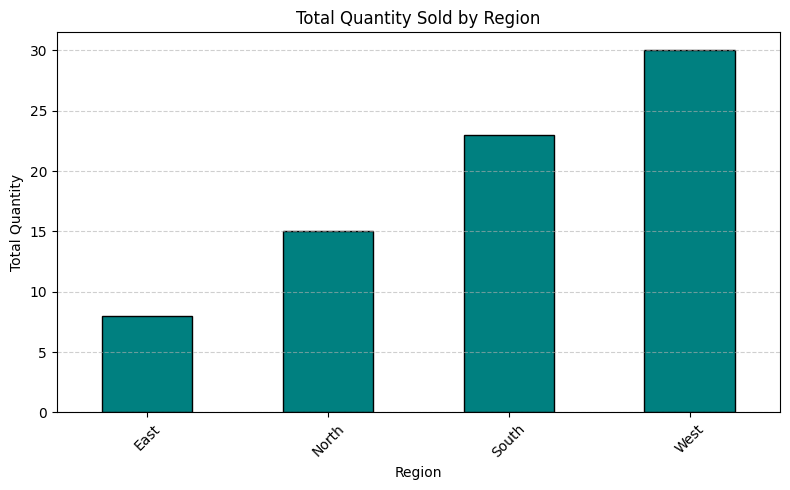

#  DSA 2040A – ETL Midterm Project  
**Name:** Selmah Tzindori  
**Student ID :** 602  

---

##  1. Project Overview

This project demonstrates the full **ETL (Extract → Transform → Load)** pipeline on a sample retail dataset. It showcases how raw sales data can be processed through various data engineering stages to prepare it for analysis or warehousing.

The goal is to simulate a real-world data pipeline using Python, Pandas, SQLite, and proper project structuring via GitHub.

---

## 2. ETL Phases & Notebooks

| Notebook               | Description                                                                                   |
|------------------------|-----------------------------------------------------------------------------------------------|
| `etl_extract.ipynb`    | Loads `raw_data.csv` and `incremental_data.csv`, inspects structure, checks for missing data, and saves raw copies to `data/`. |
| `etl_transform.ipynb`  | Applies **4 transformations**: cleaning, enrichment, structural changes, and categorization (including a unique transformation: customer tier classification). Shows before/after previews and saves cleaned data. |
| `etl_load.ipynb`       | Loads transformed datasets into **SQLite databases**, verifies using SQL queries, and includes a bonus **visualization** of total quantity by region. |

---

##  3. Tools Used

- **Python**: Core programming language  
- **Pandas**: Data manipulation and transformation  
- **SQLite3**: Lightweight relational database used for loading  
- **Jupyter Notebook**: Interactive development environment  
- **Matplotlib / Seaborn**: *(optional) visualizations  

---

## 4. How to Run the Project

1. **Clone the Repository**
   ```bash
   git clone https://github.com/SelmahT/DSA2040A_ETL_Midterm_Selmah_602.git
   cd DSA2040A_ETL_Midterm_Selmah_602
   ```

2. **Install Required Libraries**
   ```bash
   pip install pandas jupyter matplotlib
   ```

3. **Run Each Notebook in Order**
   ```bash
   jupyter notebook
   ``` 
- Step 1: Run etl_extract.ipynb

- Step 2: Run etl_transform.ipynb

- Step 3: Run etl_load.ipynb 


4. **Verify outputs**  
- Transformed files will be saved in transformed/

- Loaded database files will be in loaded/

- SQL queries in the notebook show verification steps 
---

## 5. Bonus – Visualization & Unique Transformation

###  Visualization: Total Quantity Sold by Region


This project includes a **bar chart** created using Matplotlib, showing total quantity sold across regions.

> This visual insight helps identify which regions perform best in terms of product movement.

---
